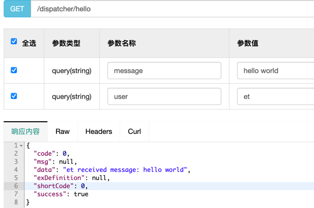

# 逻辑分发组件
> 开发者可通过给指定类和方法添加注解 @ReqAction(module="xxx") & @ReqMethod(cmd="xxx"), 以此来注册一个处理方法 <br/>
> 插件会自动将所有处理方法缓存在 ActionDispatcher 的 handlerMap 中, 对应的key为 根据 module和cmd 构造的 ReqNames 对象 <br/>
> 指定bean只需要注入 ActionDispatcher 即可根据 module 和 cmd 动态的调用指定方法 <br/>
> 主要用于根据websocket消息内容分发至相应请求 <br/>

## 使用姿势
* 构建组件, 安装到本地仓库
```
mvn clean install
```

* 在你的项目中添加依赖如下:
```xml
<dependency>
    <groupId>com.zoi7</groupId>
    <artifactId>component-dispatcher-action</artifactId>
    <version>1.0-SNAPSHOT</version>
</dependency>
```

* 在类上加上@ReqAction注解，在响应方法上加上@ReqMethod注解，如下：
```java
@ReqAction("hello")
public class HelloAction {

    @ReqMethod("yjy")
    public String yangjiayi(String message) {
        return "yjy received message: " + message;
    }

    @ReqMethod("et")
    public String et(String message) {
        return "et received message: " + message;
    }

    @ReqMethod
    public String default0(String message) {
        return "no one received message: " + message;
    }
}
```
* 在其他Bean中注入 ActionDispatcher，并调用分发，如下：
```java
@RestController
@RequestMapping("dispatcher")
public class HelloController {
    
    @Autowired
    private ActionDispatcher actionDispatcher;
    
    @GetMapping("hello")
    public JsonResult<String> hello(String user, String message) throws ExecutionException, InterruptedException {
        // 根据user参数来动态调用不同的处理逻辑
        Future<String> future = actionDispatcher.doDispatcher("hello", user, message);
        return JsonResult.success(future.get());
    }
}
```
* 效果如下
> 

## 拦截器支持
1. 组件支持对逻辑分发进行统一拦截处理，支持前置拦截/后置拦截，只需申明一个实现 ActionInterceptor 的Bean即可，支持多拦截器，支持优先级，demo实现如下:
```java
@Component
public class MyActionInterceptor implements ActionInterceptor {

    private static final Logger logger = LoggerFactory.getLogger(MyActionInterceptor.class);

    @Override
    public int order() {
        return 0;
    }

    @Override
    public boolean needIntercept(String module, String cmd) {
        return true;
    }

    @Override
    public boolean preAction(String module, String cmd, Object... params) throws Exception {
        logger.info("开始执行Action[{}:{}], 参数: {}", module, cmd, params);
        return true;
    }

    @Override
    public Object postAction(String module, String cmd, Object result, Object... params) throws Exception {
        logger.info("执行完成Action[{}:{}], 返回值: {}, 参数: {}", module, cmd, result, params);
        return result;
    }
}
```

## 需要注意的地方
1. ReqAction注解只能在类上，ReqMethod只能在方法上，并且需要保证此类在SpringBean的扫描范围内
2. @ReqAction与@ReqMethod 的value是允许为空的, 如果为空, 那么在无法精确匹配的情况下会模糊匹配处理方法, 如: {module: "room", cmd: "joinRoom"} 的方法未找到, 则会尝试{module: "room", cmd: ""}, 如果还是未匹配到, 则会尝试 {module: "", cmd: ""}, 如果依旧找不到, 则抛出 MethodNotFoundException.

## 组件支持的配置项
```properties
# 分发线程池的 核心线程数 （并发能力），默认100
component.dispatcher.action.threads = 100
# 空闲线程保留时间，默认1分钟
component.dispatcher.action.keepAliveTime = 1
component.dispatcher.action.timeUnit = MINUTES
# 允许堆积的请求数量，默认2000
component.dispatcher.action.acceptRequest = 2000
# 请求初始化阻塞超时时间, 单位: 秒 (当请求进来发现处理器未初始化完成时的等待时间)，默认30s
component.dispatcher.action.waitInitTimeout = 30
```
## 模糊匹配的功能的应用
1. 请求的统一处理: 定义{module: "room", cmd: ""}的方法来处理所有 module=room的请求
2. 请求未找到时的处理, 定义{module: "", cmd: ""}的方法来处理所有未被找到的请求, 如打印错误日志等.